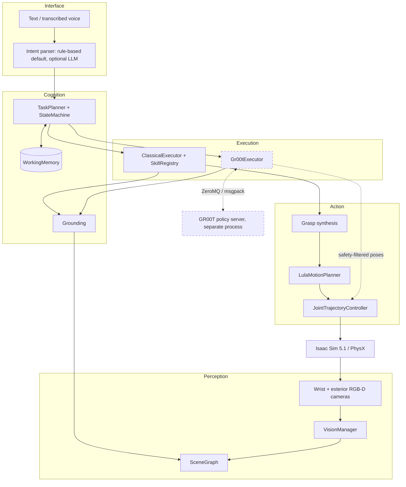
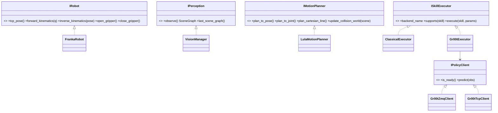
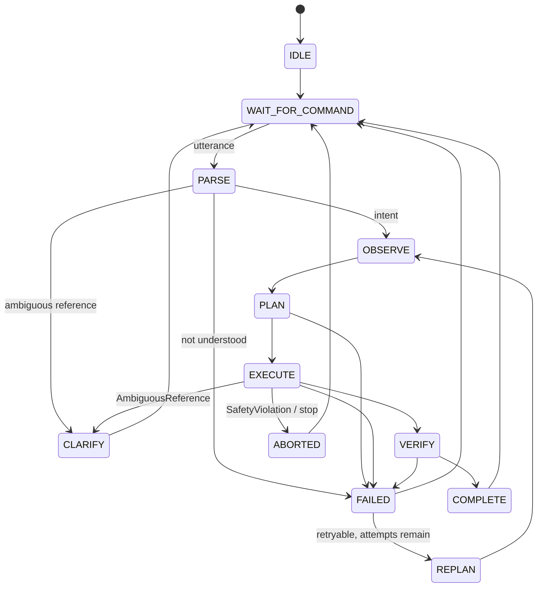
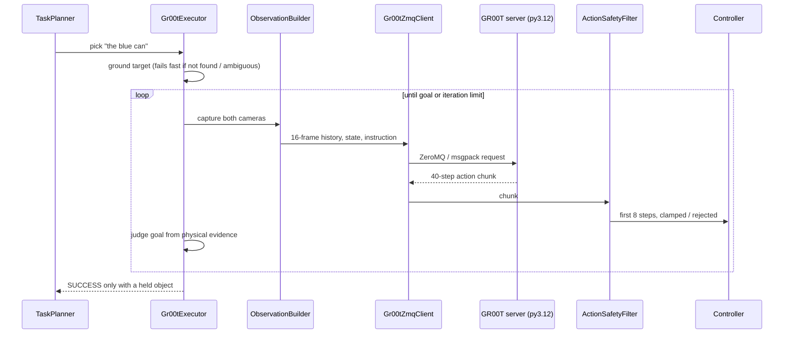

# Multimodal Conversational Robotic Arm for Natural Language-Based Object Manipulation — Architecture

**Capstone Project — Team 178**

Design of the simulation lane on branch `capstone-completion`: Isaac Sim 5.1 + PhysX, Franka Panda,
package `mfw/`. Object targets come from perception (Isaac ground-truth instance segmentation +
depth; no spawn pose is read), grasp poses are generated from the perceived box, and arm motions are
planned online. For how to run it, see
[README.md](README.md); for the dated test and run record, see
[SYSTEM_VERIFICATION.md](SYSTEM_VERIFICATION.md).

Status labels follow the README: IMPLEMENTED (verified / not verified), NOT CURRENTLY OPERATIONAL,
PLANNED.

---

## 0. Three findings that shaped the design

### 0.1 GR00T is a peer backend, not a layer between planner and motion planner

GR00T N1.7's inference-ready manipulation embodiment (`oxe_droid_relative_eef_relative_joint`) takes

| Modality | Contract |
|---|---|
| `video` | `exterior_image_1_left`, `wrist_image_left`, `delta_indices=[-15, 0]` |
| `state` | end-effector pose, gripper position, joint positions |
| `action` | a 40-step chunk of end-effector poses + gripper |
| `language` | the instruction string |

It is a motion generator: it emits end-effector motion, not symbolic actions like `Pick(can)`, so it
cannot sit above a motion planner. The classical pipeline and GR00T are therefore **peer backends**
behind one `ISkillExecutor` interface, chosen per skill by config. Consequences: an exterior camera is
mandatory (the embodiment needs both views), and a 16-frame observation history is buffered to serve
`delta_indices=[-15, 0]`.

### 0.2 Franka Panda

- It is the only arm in this Isaac install with a shipped Lula **RRT** path-planner config
  (`path_planner_configs/franka`), i.e. the only one with global collision-aware planning out of the box.
- GR00T's inference-ready manipulation tag was trained on DROID, which is a Franka Panda with a
  parallel gripper and wrist camera.

### 0.3 The stock Franka end-effector frame is one finger, not the TCP

Isaac's shipped example uses `panda_rightfinger` as the end effector. Measured via Lula FK, in the
`panda_hand` frame:

| Frame | Offset |
|---|---|
| `panda_rightfinger` | `[0, -0.025, 0.0584]` |
| `panda_leftfingertip` | `[0, +0.025, 0.1034]` |
| `panda_rightfingertip` | `[0, -0.025, 0.1034]` |
| **TCP (fingertip midpoint)** | **`[0, 0, 0.1034]`** |

Planning against the finger frame drives the gripper 51.5 mm short and to one side while every log
line reports success. The TCP is `panda_hand` + `robot.tcp_offset_from_hand` (`[0, 0, 0.1034]`), and
`IRobot.tcp_pose()` is the only end-effector pose other layers see. Covered by the Phase 1 Isaac tests
(`TestTcpFrame`).

---

## 1. Layer model

Rules the code follows:

1. `core/`, `utils/`, `config/`, `language/`, `planner/`, `memory/`, `grasp/` and `gr00t_bridge/`
   never import Isaac Sim at module scope, so they are unit-tested in a plain Python 3.12 interpreter
   (the pure-logic suite).
2. Only `vision/` (and the GR00T bridge, which captures raw RGB for the policy's observation)
   touches cameras. Planner and classical skills receive a `SceneGraph`.
3. Only `controllers/` writes joint targets. Nothing writes an object's pose.
4. Skills are atomic: a skill never invokes another skill.



Dashed: optional, disabled by default.

---

## 2. Package layout (this branch)

```
mfw/
├── assistant.py     top-level wiring: clause splitting, clarification dialogue, voice confirmation
├── core/            types.py, interfaces.py, errors.py
├── config/          schema.py (typed, strict: unknown YAML keys are errors)
├── utils/           transforms.py, logging.py (JSONL event log)
├── simulation/      app.py, scene.py, runtime.py, asset_registry.py, layout.py, validation.py
├── physics/         materials.py, contact.py (grasp verification), collision.py (colliders)
├── robot/           franka.py
├── vision/          camera.py, geometry.py, tracking.py, scene_graph.py, manager.py
├── grasp/           generator.py, scorer.py
├── motion/          planner.py (Lula RRT + Cartesian line), trajectory.py
├── controllers/     joint_controller.py
├── memory/          working_memory.py
├── skills/          base.py, primitives.py, registry.py (ClassicalExecutor)
├── planner/         task_planner.py, state_machine.py
├── language/        intent_parser.py, grounding.py, speech.py
├── gr00t_bridge/    executor.py, observation.py, safety.py, zmq_client.py, client.py, server.py
└── isaaclab_ext/    empty placeholder (PLANNED: data generation for fine-tuning)
```

Entry points are in `scripts/`; every tunable is in `configs/*.yaml`.

---

## 3. Module responsibilities

| Module | Owns | Must never |
|---|---|---|
| `core` | Data contracts, interfaces, error taxonomy | Import Isaac |
| `config` | Every tunable; strict validation | Contain logic |
| `vision` | Cameras, depth, segmentation, poses, tracking, scene graph | Expose pixels to the planner |
| `language` | Utterance -> intent; referent -> one perceived object | Guess between candidates |
| `grasp` | Generating and scoring candidates from geometry | Contain a literal grasp pose |
| `motion` | Online collision-aware planning | Load a recorded trajectory |
| `controllers` | Writing joint targets, tracking, workspace checks | Write an object pose |
| `memory` | Held object, last referent, command history (track ids) | Cache object poses as truth |
| `skills` | Atomic actions | Call another skill |
| `planner` | One skill per clause, state machine, recovery policy | Access cameras |
| `gr00t_bridge` | Policy IPC, observation building, action safety filter | Run the model in Isaac's interpreter |

---

## 4. Core interfaces



`Gr00tZmqClient` speaks NVIDIA's PolicyServer protocol (ZeroMQ + msgpack) to `scripts/groot_server.py`;
`Gr00tTcpClient` talks to the deterministic `MockPolicy` in `gr00t_bridge/server.py` for tests.

---

## 5. Command flow and state machine

`Assistant.command` splits an utterance into clauses before parsing:
- conjunctions: "pick up the block and place it in the box" -> two clauses;
- transfers: "move the red block onto the green box" -> "pick the red block", "place it on the green box".

Each clause runs as its own planner command, in order, stopping at the first that does not succeed.
The parser returns exactly one intent per clause; nothing chains a follow-up action.



The transition table is enforced (`StateMachine.to` raises on an illegal edge). `COMPLETE` has one
outgoing edge, back to `WAIT_FOR_COMMAND`, which is what makes commands atomic.

**Recovery policy** (`state_machine.recovery_for`, `TaskPlanner._execute_with_recovery`), decided by
the kind of failure, never by blind retry:

| Failure | Next state | Retried? |
|---|---|---|
| `AmbiguousReference` | CLARIFY: "Which one do you mean: ...?" with the options | No |
| `ObjectNotFound` | FAILED, message lists what is visible | No |
| `SafetyViolation` | ABORTED | Never |
| `PlanningError`, other `PerceptionError` | REPLAN from a fresh observation | Up to `motion.max_replan_attempts` (3) |
| Skill result `INFEASIBLE` (e.g. object too wide) or `retryable=False` | FAILED | No |
| Skill result `FAILED` (any other) | REPLAN from a fresh observation | Up to `motion.max_replan_attempts` (3) |

Reference failures are recognised whether raised or returned in a skill result. The operator's answer
to a clarification is resolved with the same grounding grammar, restricted to the offered options
(`grounding.interpret_clarification`), and the clause is re-run with the chosen object.

**Stop / emergency stop** are skills (`Stop`, `EmergencyStop`) processed between commands. They cannot
interrupt a skill that is already executing (interrupting a running skill is PLANNED).

**Voice confirmation**: a spoken command that parses to a motion skill is confirmed before it runs
(`requires_confirmation`), because Canary reports no per-utterance confidence.

---

## 6. Language: parsing and grounding

**Intent parsing** (`language/intent_parser.py`)
- `RuleBasedIntentParser` is the default and the only parser exercised in the recorded runs.
- `LlmIntentParser` sends a constrained prompt to a resident worker (`scripts/llm_worker.py`,
  default `Qwen/Qwen2.5-3B-Instruct`, TCP `127.0.0.1:5557`, own interpreter) and falls back to the
  rule parser on any failure. IMPLEMENTED (not verified): the model was not present on the test machine.
- Place parameters: `{}` (back where picked), `{relation, target}` with relations
  in/on/next_to/to/left_of/right_of/in_front_of/behind, or `{relation: direction, direction, distance}`
  (default 10 cm, relative to the pick point, robot frame +X forward, +Y left).

**Grounding** (`language/grounding.py`, pure Python) turns a referent phrase into exactly one
perceived object:
- generic nouns (object, thing, one, item) are class wildcards;
- colour from the perceived colour name; an exact colour beats an adjacent hue, a different known
  colour never matches;
- class synonyms (cube/brick -> block, cylinder/tin -> can, carton -> box); the exact class wins;
- size adjectives and superlatives rank by box volume (height for tall/short) and need a 20 % margin,
  otherwise the result is ambiguous;
- position: left/right (+Y is the robot's left), leftmost/rightmost/middle, front/back,
  nearest/farthest from the robot;
- relations: "<X> next to / on / in / under / left of / behind <Y>" via the scene graph relations
  (IMPLEMENTED, unit-tested; not exercised in an Isaac run).

No match -> `ObjectNotFound` naming the qualifier that failed and everything visible. Several equal
matches -> `AmbiguousReference` with distinguishing descriptions. Pronouns ("it", "that") go through
`WorkingMemory.resolve_reference` first: held object, then last referenced object.

---

## 7. Cameras

| | Wrist | Exterior |
|---|---|---|
| Mount | Parented to `panda_hand` | Static, oriented by `look_at` |
| Purpose | Close-range view, grasp re-centring | Scene-wide observation |
| GR00T key | `wrist_image_left` | `exterior_image_1_left` |

Axis conventions are the subtle part. USD cameras look down -Z with +Y up; the projection maths
uses OpenCV (+Z forward, +Y down); Isaac's `Camera` class re-interprets pose arguments in its own
`camera_axes` convention (default "world", +X forward). Passing a USD quaternion through Isaac's pose
API silently aimed the exterior camera at the horizon while pose queries echoed back the requested
value. The framework writes and reads the raw USD xform and applies the USD->OpenCV flip once, in
`Camera.get_extrinsics()`.

Lighting is declared per scene. On the benchmark (office) scene, dome and distant lights contribute
nothing indoors; light comes from `scene.workspace_light_intensity`.

---

## 8. Perception

**Isaac ground-truth instance segmentation + depth, not a learned detector.**

```mermaid
flowchart LR
    A[Wrist + exterior cameras] --> B[RGB / depth / instance segmentation]
    B --> C[Deproject to world points]
    C --> D[Per-instance clouds, per camera]
    D --> E[Filter: range, support plane, outliers, percentile trim]
    E --> F[Oriented box + pose from the best-supported single view]
    F --> G[Colour name from the object's pixels]
    G --> H[Tracker: stable track ids]
    H --> I[SceneGraph + spatial relations]
```



- Object identity and class come from the renderer's instance segmentation and semantic labels
  (prim path + label). Pose, size and colour are estimated from the segmented depth points and pixels.
  The framework never reads a spawn pose (only the benchmark script reads ground truth, to judge
  success). This would not carry over to a real camera without a detector.
- **Single view, not fused.** Concatenating the two cameras' partial surfaces measured a 0.05 m cube
  as 0.095 m. Each camera is fitted separately and the view with most support is used; the other view
  raises confidence when it agrees. Single-view bias can offset a large box's centre by about 5 cm.
- Invalid depth is dropped, never clamped (clamping invents a surface at the range limit).
- Tracks need corroboration across two frames before they are confirmed; they age out after
  `perception.track_max_age_steps`.
- **Colour warm-up.** Headless, `SimulationContext.step` does not render, so every `observe()`
  renders `perception.render_frames_before_capture` (8) frames first. Unlit frames do not vote on
  colour, a known colour is held until frames agree, and at start-up the assistant observes (bounded)
  until colours have settled. Result: correct colours on the first "what do you see" in the recorded runs.

---

## 9. Grasp synthesis

No grasp pose is written down. From the object's oriented box:

1. Enumerate antipodal axis pairs; reject any whose width is outside
   `[min_grasp_width, max_grasp_width - finger_width_margin]` (78 mm - 10 mm: largest graspable
   object 68 mm) before any planning cost. Wider objects are refused as INFEASIBLE.
2. Sample `num_orientation_samples` wrist rotations per approach axis.
3. Score width margin, approach alignment (top-down bias), distance from the centroid,
   reachability (IK) and clearance.
4. Emit a pre-grasp pose `approach_offset` back along the approach axis so the final approach is a
   straight line.

Pick re-observes from the pre-grasp standoff and re-centres the grasp on the fresh estimate before
descending.

---

## 10. Motion planning

| Planner | Use | Source |
|---|---|---|
| Lula **RRT** | Free-space, collision-aware motion | `path_planner_configs/franka` |
| Straight-line Cartesian | Approach, lift, retreat, relative moves | `plan_cartesian_line` |

RMPflow is not used. `motion.planner` accepts `rmpflow`, but nothing reads that field; the only
planner built is `LulaMotionPlanner` (RRT + Cartesian line).

- Before every RRT plan the collision world is rebuilt from the scene graph (inflated proxy
  cuboids); the grasp target is excluded while it is being grasped. Straight-line Cartesian segments
  (approach, lift, retreat, relative moves) are not collision-checked: the code relies on them being
  short and straight, with the approach bounded by the pre-grasp standoff.
- RRT returns the first feasible path, not a good one, so each motion runs up to `plan_attempts` (4)
  queries with different seeds and keeps the shortest path.
- `plan_with_retries` re-solves IK from different warm starts, so a retry tries a different IK branch
  rather than the same rejected goal configuration.
- The controller aborts on sustained deviation from the path (`tracking_error_limit`,
  `tracking_violation_steps`) or no progress (`stall_abort_steps`). Goals must lie inside the
  workspace box; intermediate waypoints get `workspace_transit_margin` (0.25 m) of slack.
- `GoHome` escapes stranded poses with a ladder of retreat moves before planning home.

---

## 11. Physics: pure PhysX

No parenting, no teleporting, no pose writing, no fake attachment. Objects move only because the
fingers push on them.

| Setting | Value | Why |
|---|---|---|
| Solver | TGS | Better than PGS on stiff parallel contact |
| Position iterations | 32 | Fewer leaves penetration and jitter |
| Finger friction | 1.6 / 1.5 | Franka pads grip far more than PhysX's 0.5 default |
| Restitution | 0.0 | Any bounce on finger contact ejects the object |
| Sleep threshold | 0.0 | A sleeping object stops responding to the hand |
| Stabilization | off | Damps the small contact velocities a grasp needs |
| CCD | on | A fast lift can tunnel a thin object through a fingertip |
| Contact / rest offset | 0.5 mm / 0.1 mm | Larger offsets leave visible daylight in the grip |

The gripper is force-limited (`robot.gripper_force`, 40 N): a fully closed position command against a
rigid object makes the drive fight the contact and eject the object.

**Grasp verification** (`physics/contact.py`) uses evidence, never "we issued a close": finger stall
width, the re-perceived object staying near the fingertips after lift, and the object rising. A close
on air reports no grasp.

**Place** aims the held object (not the TCP) at the destination, releases at the held object's own
half height, retreats, re-observes, and reports the settled distance. A miss beyond
`grasp.place_tolerance_m` (50 mm) is reported as a failure, not a success.

---

## 12. GR00T bridge (optional backend)

Status: bridge and inference IMPLEMENTED (verified 2026-09-25); task success NOT CURRENTLY
OPERATIONAL (zero-shot pick 0/2). Full status in the README.

**Always out of process.** Isaac Sim 5.1 ships Python 3.11; GR00T needs 3.12 and its own torch stack.
The server (`scripts/groot_server.py`) runs in a separate venv, started by
`scripts/start_groot_server.ps1`, which sets the server's environment on the child process only.



- `--groot --groot-skills pick` routes the named skills to `Gr00tExecutor`; it supports pick, place,
  move_to, move_relative and look_at and declines the rest (observe, go_home, stop...), which stay
  classical. Only pick has been exercised with the real model.
- Execute a prefix (8 of 40 steps), then re-observe.
- The policy's actions are read as absolute world-frame poses (`gr00t.actions_are_absolute`).
- **Safety filter**: a step larger than `max_relative_translation` (5 cm) or `max_relative_rotation`
  (0.35 rad) is scaled down, not rejected; non-finite or wrong-sized actions raise `SafetyViolation`.
  With absolute actions (the default) a target outside the workspace box, whose z floor is the table
  top plus 15 mm, is clamped onto it and counted as clamped. In delta mode it raises.
- **Honesty rules** (added after a 2026-09-24 run falsely reported success): the target is grounded
  before the policy runs; a pick succeeds only if the gripper reports a grasp and the resolved object
  is within reach of the TCP and held; a place succeeds only on a real release.
- If the server is unreachable, the assistant logs a warning and continues classical-only.
- Every iteration logs TCP start/end, largest step, gripper output, clamped/rejected counts and the
  goal verdict to `events.jsonl`.

---

## 13. Memory

`WorkingMemory` stores track ids, not poses: poses are always re-perceived. It holds the held object,
the last referenced object, a scene snapshot at pick time (used by "place it back"), and bounded scene
and command histories. Pronoun resolution order: held object, then last referenced; anything else goes
to grounding, which asks rather than guesses.

---

## 14. Test gates

Phase markers in `pytest.ini` tag tests by layer: `phase1` robot/cameras/physics, `phase2` vision,
`phase3` motion, `phase4` grasp, `phase5` pick, `phase6` place, `phase7` language/planner (Isaac tests
carry the `isaac` marker as well), `phase8` speech (pure logic). The decisive Phase 5 assertion is that an object's
ground-truth height rises by more than 3 cm on pick; since nothing writes an object pose, only contact
and friction can raise it.

Recorded results (2026-09-24): pure-logic suite 1069 passed, 3 skipped; Isaac suite 99/99. Commands in
the README.

---

## 15. Bugs the gates caught

Kept because most were silent: the API returned plausible values while the robot did the wrong thing.

| Bug | Symptom | Why it was silent |
|---|---|---|
| Isaac `Camera` axis convention | Exterior camera saw the horizon; depth NaN, segmentation empty | `get_world_pose()` echoed the requested quaternion |
| `SimulationApp` parses `sys.argv` | Isaac tests exited 0 with a truncated report | pytest's flags reached omni.kit as ill-formed parameters |
| Multi-camera fusion | A 0.05 m cube measured 0.095 m | Two partial surfaces span more than the object |
| PCA yaw on a square footprint | A 0.12 m box measured 0.21 m | Degenerate covariance puts the axis near 45 degrees |
| Segmentation halo | Boxes inflated by a skirt of table points | Edge pixels interpolate depth onto the background |
| Time-indexed tracking error | Long motions aborted mid-way | Position control lags its setpoint; now deviation from the path is measured |
| `interpolation_dt` not a multiple of `physics_dt` | Lag grew to ~0.4 rad over 2 s | Waypoints ran 20 % ahead of physics |
| Strict workspace check on every waypoint | Random aborts on valid picks | RRT paths legitimately arc outside the box; now goals are strict, waypoints get a margin |
| Retrying one IK solution | Same rejected goal on every retry | IK was always seeded from the start state |
| Matcher order beat atomicity | "pick X and put it in Y" parsed as place | Utterances are now split at conjunctions first |
| Punctuation stripping ate decimals | "move right 0.3 m" became 3 m | `[^\w\s]` turned "0.3" into "0 3" |
| PEP 563 string annotations | Tuple config fields stayed lists | `dataclasses.Field.type` is a string |
| First look reported black objects | "black block, black can, black box" | Headless steps do not render; colour warm-up added |
| GR00T pick reported success on air | "SUCCESS" with nothing held | Old goal test accepted any closed gripper; target was unresolved |
| Place "next to" always +Y, unclamped | Released at the edge of reach, reported success | Side is now chosen from free, reachable sides and misses are reported |

---

## 16. Not in this branch

- **Isaac Lab** (`mfw/isaaclab_ext/` is an empty placeholder). PLANNED role: domain-randomised data
  generation to fine-tune GR00T on this embodiment.
- **ROS 2**: no ROS 2 code exists. The layer boundaries are ABCs (`ICamera`, `IController`,
  `IPerception`, ...), which is where a ROS 2 adapter would plug in. PLANNED.
- **Physical hardware**: a hardware lane is in development and is not part of this branch.
