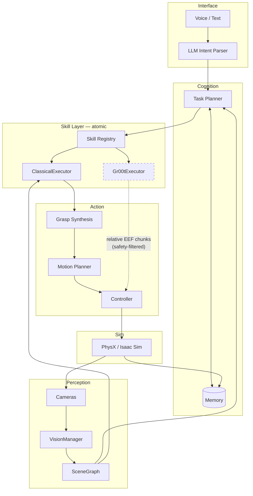
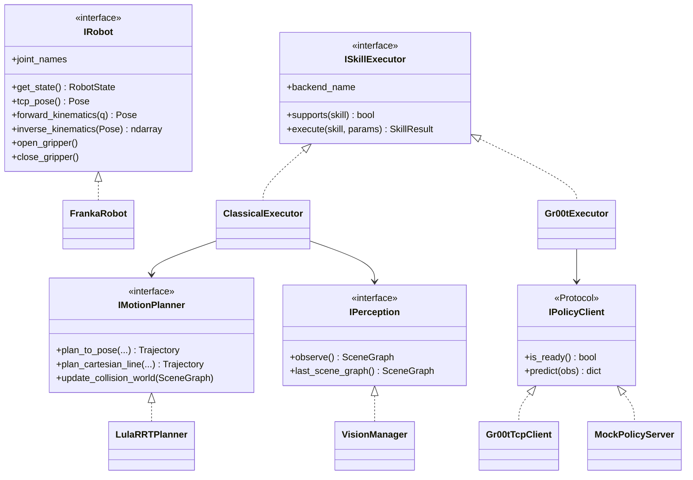
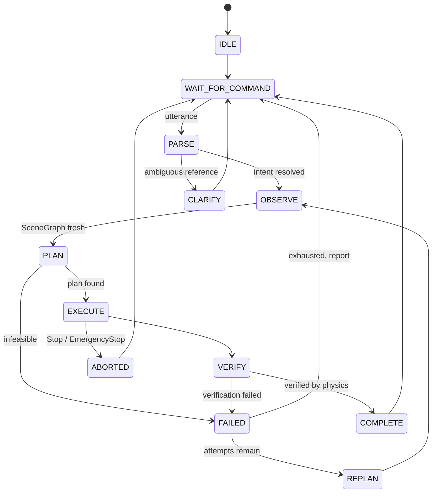
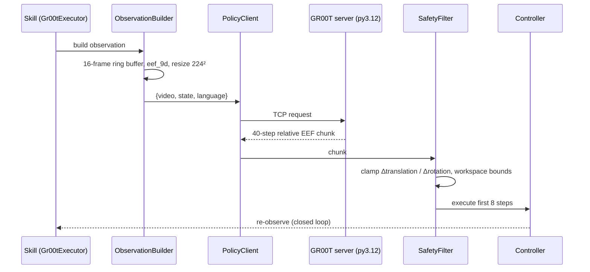
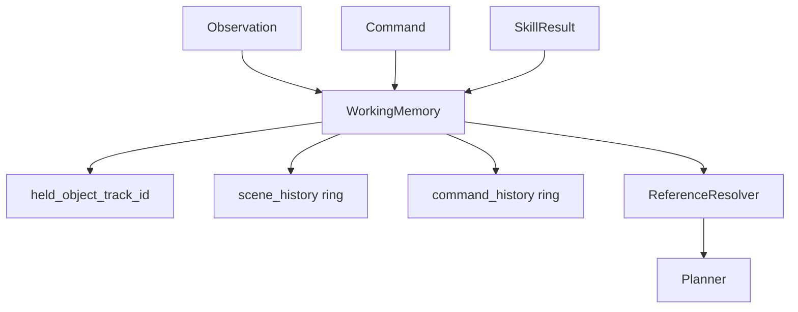

# Multimodal Conversational Robotic Arm for Natural Language-Based Object Manipulation — Architecture

**Capstone Project — Team 178**

A modular robotic manipulation framework on Isaac Sim 5.1 + PhysX, with a GR00T N1.7
policy backend. Every behaviour emerges from perception, planning and memory. There are
no hardcoded object positions, no hardcoded grasp poses, and no scripted task sequences.

> **Status.** All eight phases are implemented and gated by tests:
> **349 pure-logic tests** (no simulator, ~8 s) and **99 Isaac integration tests**,
> all passing. Section 14 records the bugs the gates caught, since several were
> non-obvious and are worth not re-introducing.

---

## 0. Three findings that shaped this design

These came from probing *this* install, not from general practice. Each one changed the
architecture, so they belong before the diagrams.

### 0.1 GR00T cannot be a layer between the planner and the motion planner

The original brief placed GR00T here:

```
LLM → Intent → Planner → GR00T → Motion Planner → Controller → Robot
```

That is not what GR00T N1.7 produces. From
`Isaac-GR00T/gr00t/configs/data/embodiment_configs.py:28`, the only inference-ready
manipulation embodiment (`oxe_droid_relative_eef_relative_joint`) declares:

| Modality | Contract |
|---|---|
| `video` | `exterior_image_1_left`, `wrist_image_left`, `delta_indices=[-15, 0]` |
| `state` | `eef_9d`, `gripper_position`, `joint_position` |
| `action` | `delta_indices=range(40)` — relative EEF (XYZ + rot6D), absolute gripper, relative joints |
| `language` | `annotation.language.language_instruction` |

GR00T emits a **40-step chunk of relative end-effector deltas**. It *is* a motion
generator. It does not emit symbolic actions like `Pick(can)`, so it cannot sit above a
motion planner.

**Resolution:** the classical pipeline and GR00T are **peer backends** behind one
`ISkillExecutor` interface, selected per-skill by config. Two further consequences:
a **second (exterior) camera is mandatory**, not optional; and a **16-frame observation
history** must be buffered to serve `delta_indices=[-15, 0]`.

### 0.2 Franka Panda is the correct robot, for two checkable reasons

- `exts/isaacsim.robot_motion.motion_generation/path_planner_configs/` contains exactly
  one entry: `franka`. It is the **only** arm in this install shipping a Lula **RRT**
  config. RMPflow configs exist for 21 robots; global collision-aware planning does not.
- GR00T's only inference-ready manipulation tag is trained on **DROID** — a Franka Panda
  with a parallel gripper and wrist camera. `LIBERO_PANDA` and `ROBOCASA_PANDA_OMRON`
  exist but require finetuned checkpoints.

Any other arm would forfeit both global planning and zero-shot policy support.

### 0.3 The stock Franka end-effector frame is wrong by 51.5 mm

Isaac's shipped example (`standalone_examples/api/isaacsim.robot.manipulators/franka_pick_up.py:50`)
sets `end_effector_prim_path="/World/Franka/panda_rightfinger"`. Measured here via Lula FK:

| Frame | Offset in `panda_hand` frame |
|---|---|
| `panda_rightfinger` | `[0, −0.025, 0.0584]` |
| `panda_leftfingertip` | `[0, +0.025, 0.1034]` |
| `panda_rightfingertip` | `[0, −0.025, 0.1034]` |
| **true TCP (fingertip midpoint)** | **`[0, 0, 0.1034]`** |
| `right_gripper` | `[0, 0, 0.1000]` (3.4 mm short) |

Planning against the finger frame drives the gripper **51.5 mm** short and to one side of
where it believes it is. Grasps close on air while every log line reports success. The
framework therefore derives the TCP from `panda_hand` + configured offset, and
`IRobot.tcp_pose()` is the only end-effector pose any other layer may see.

---

## 1. Layer model

Four rules the code enforces:

1. `core/`, `utils/`, `config/` **never import Isaac Sim** — so geometry, config and
   planning logic stay unit-testable in a plain interpreter (58 tests, 1.3 s, no GPU).
2. Only `vision/` touches cameras. The planner receives a `SceneGraph`.
3. Only `controllers/` writes joint targets. **Nothing writes an object's pose.**
4. Skills are atomic. **A skill never invokes another skill.**



`Gr00tExecutor` is dashed: it is a **peer** of `ClassicalExecutor`, not a stage in a chain.

---

## 2. Folder structure

```
manipulation_framework/
├── mfw/
│   ├── core/          types.py, interfaces.py, errors.py   ← no Isaac imports
│   ├── config/        schema.py (typed, strict, validated) ← no Isaac imports
│   ├── utils/         transforms.py, logging.py            ← no Isaac imports
│   ├── simulation/    app.py, scene.py, runtime.py
│   ├── physics/       materials.py, contact.py
│   ├── robot/         franka.py, kinematics.py, gripper.py
│   ├── vision/        camera.py, manager.py, detection.py,
│   │                  pose_estimation.py, scene_graph.py
│   ├── grasp/         generator.py, scorer.py
│   ├── motion/        rrt_planner.py, rmpflow.py, trajectory.py
│   ├── controllers/   joint_controller.py, cartesian_controller.py
│   ├── memory/        working_memory.py, reference_resolver.py
│   ├── skills/        base.py, registry.py, primitives.py, executors/
│   ├── planner/       task_planner.py, state_machine.py
│   ├── language/      intent_parser.py, grounding.py
│   ├── gr00t_bridge/  client.py, server.py, observation.py, safety.py
│   └── isaaclab_ext/  (optional, out of the runtime path — data generation only)
├── configs/           default.yaml  ← every tunable lives here
├── tests/             pure-logic + phase-gated Isaac suites
├── scripts/           run_isaac_tests.py, run_command.py
└── logs/              <run_id>/events.jsonl
```

Each module depends only on `core` interfaces and its own layer.

---

## 3. Module responsibilities

| Module | Owns | Must never |
|---|---|---|
| `core` | Data contracts, interfaces, error taxonomy | Import Isaac |
| `config` | Every tunable; strict validation | Contain logic |
| `vision` | Cameras, depth, segmentation, poses, scene graph | Expose pixels to the planner |
| `grasp` | Generating + scoring candidates from geometry | Contain a literal grasp pose |
| `motion` | Online collision-aware planning | Load a recorded trajectory |
| `controllers` | Writing joint targets, tracking | Write an object pose |
| `memory` | Robot/scene state, reference resolution | Cache stale object poses as truth |
| `skills` | Atomic actions | Call another skill |
| `planner` | Command → action graph, state machine | Access cameras |
| `gr00t_bridge` | Out-of-process policy IPC + safety clamps | Run in Isaac's interpreter |

---

## 4. Class diagram (core interfaces)



---

## 5. State machine

Atomicity is structural: `COMPLETE` always returns to `WAIT_FOR_COMMAND`. There is no
edge from one skill's completion to another skill's start.



`VERIFY` reads **contact forces**, never "we issued a close command".

---

## 6. Camera pipeline

Two cameras, because `oxe_droid` requires both.

| | Wrist | Exterior |
|---|---|---|
| Mount | Parented to `panda_hand` | Static |
| Purpose | Servoing, close-range verification | Scene-wide observation |
| GR00T key | `wrist_image_left` | `exterior_image_1_left` |

**Axis conventions** — the subtlest part, and the source of a real bug found in Phase 1:

- USD cameras look down **−Z**, +Y up.
- Projection maths uses OpenCV: **+Z forward**, +Y down.
- Isaac's `Camera` class re-interprets pose arguments in its own `camera_axes`
  convention, defaulting to `"world"` (**+X forward**).

Passing a USD-convention quaternion through Isaac's pose API silently rotated the
exterior camera onto the horizon — depth full of NaN, empty segmentation — while every
pose query echoed back the requested value. The framework therefore **writes and reads
the raw USD xform directly** and applies the USD→OpenCV flip exactly once, in
`Camera.get_extrinsics()`.

Static camera orientation is derived from a `look_at` target, not a hand-written
quaternion, because a slightly-wrong quaternion produces an image of empty floor that
reads downstream as "the detector found nothing".

Lighting is declared explicitly (dome + distant key). Isaac's implicit default light
falls off sharply: measured here, the wrist camera at 30 cm rendered correctly while the
exterior camera at 1.5 m rendered black.

---

## 7. Perception pipeline


Guarantees:

- **Nothing hardcoded.** Ground-truth spawn poses exist only in scene config; no runtime
  accessor returns them.
- **Objects may appear, move, rotate or vanish.** Tracks age out after
  `track_max_age_steps`.
- **Freshness enforced.** A skill refuses a `SceneGraph` older than
  `max_scene_graph_age_s`.
- **Invalid depth is dropped, never clamped** — clamping invents a surface at the range
  limit that the grasp planner would happily plan against.
- Segmentation carries both a **class** (`can`) for language grounding and a **prim path**
  for instance identity, since a class alone cannot separate two identical cans.

---

## 8. Grasp synthesis

No grasp pose is ever written down. Candidates are generated from perceived geometry:

1. From the OBB, enumerate antipodal axis pairs; reject any whose width falls outside
   `[min_grasp_width, max_grasp_width − finger_width_margin]` before any planning cost.
2. Sample `num_orientation_samples` wrist rotations about each approach axis.
3. Score: width margin, approach alignment (top-down biased by `top_grasp_bias`),
   distance from the OBB centroid, reachability (IK exists), and collision clearance.
4. Emit `pregrasp_pose` offset `approach_offset` back along the approach axis, so the
   final approach is a **straight line** — a curved approach sweeps the fingers through
   the object.

---

## 9. Motion planning

| Planner | Use | Source |
|---|---|---|
| Lula **RRT** | Global, collision-aware, obstacle avoidance | `path_planner_configs/franka` |
| **RMPflow** | Reactive servoing, VLA action following | `motion_policy_configs/franka` |

Straight-line Cartesian motion is a **separate** interface method (`plan_cartesian_line`)
from free-space planning, because approach and lift must not curve. Obstacles come from
perception via `update_collision_world(scene)` before every plan. Failure triggers
`REPLAN` up to `max_replan_attempts`; trajectories abort if tracking error exceeds
`tracking_error_limit`.

---

## 10. Physics pipeline — pure PhysX

No parenting. No teleportation. No pose writing. No fake attachment.

A parallel-jaw grasp is a stiff, nearly-redundant contact problem; with PhysX defaults the
object buzzes and squirts out, which is exactly what tempts people into fake attachment.
The settings that make real contact hold:

| Setting | Value | Why |
|---|---|---|
| Solver | **TGS** | Far better than PGS on stiff parallel-surface contact |
| Position iterations | 32 | 4 leaves visible penetration and jitter |
| Finger friction | 1.6 / 1.5 | Franka's pads are far grippier than PhysX's 0.5 default |
| Restitution | 0.0 | Any bounce on finger contact ejects the object |
| Sleep threshold | 0.0 | A slept object stops responding to the hand |
| Stabilization | off | Damps the small contact velocities a grasp depends on |
| CCD | on | A fast lift can tunnel a thin object through a fingertip |
| Contact/rest offset | 2 mm / 0.5 mm | Larger offsets produce a visible floating grasp |

**Gripper control is force-limited, not positional.** Commanding a fully-closed *position*
against a rigid object makes the drive fight the contact constraint at unbounded force,
and the solver resolves the conflict by ejecting the object. Capping `maxForce` turns the
same command into a bounded squeeze that settles.

**Grasp verification** reads contact forces and finger geometry. A close that caught air
closes fully and reports `is_grasping = False` — verified by a passing test.

---

## 11. GR00T integration

**GR00T always runs out-of-process.** This is a hard constraint, not a preference:

| | Isaac Sim 5.1 | GR00T N1.7 |
|---|---|---|
| Python | **3.11.13** | **≥3.12, <3.13** |
| `flash-attn`, `deepspeed` | — | `sys_platform == 'linux'` only |

They cannot share an interpreter under any configuration.



Design points:

- **Execute a prefix, then re-observe** (`actions_executed_per_chunk: 8` of 40). Open-loop
  execution of a full chunk drifts.
- **Safety filter is mandatory.** A predicted delta exceeding
  `max_relative_translation` / `max_relative_rotation` raises `SafetyViolation` and is
  never retried.
- **Transport is host-agnostic.** Moving the server from Windows to WSL2 is a `host` change.

> **Deployment note.** Per your decision, the server targets Windows Python 3.12. That is
> an **unsupported** path: NVIDIA gates `flash-attn`/`deepspeed` to Linux, so attention
> falls back to eager, and Blackwell (sm_120) needs CUDA 12.8+ wheels. The `use_mock_server`
> flag keeps everything testable meanwhile, and WSL2 Ubuntu-22.04 (glibc 2.35, exactly
> flash-attn's minimum) remains a config change away if the native path stalls.

---

## 12. Memory architecture



Resolution order for `"place it"`:

1. **Held object** — if the gripper holds something, `"it"` is that object.
2. **Last referenced** — otherwise the most recent object named in a command.
3. **Unique class match** — otherwise a class matched in the current scene graph.
4. **Ambiguous** → raise `AmbiguousReference` and **ask**. Never guess.

Memory stores `track_id`s, not poses: poses are always re-perceived, so a remembered
object that has since moved is re-measured rather than trusted.

---

## 13. Implementation plan

Each phase gates the next. `pytest -m phaseN` must be green before starting N+1.

| Phase | Scope | Gate |
|---|---|---|
| **1** | Robot, cameras, physics, TCP, IK, calibration | ✅ 28 Isaac tests |
| **2** | VisionManager, 6-DoF pose, tracking, SceneGraph | ✅ 16 Isaac + 29 logic |
| **3** | Lula RRT + Cartesian planning, trajectory execution | ✅ 16 Isaac + 21 logic |
| **4** | Grasp generation and scoring | ✅ 8 Isaac + 25 logic |
| **5** | `Pick` — physics grasp + lift + verify, then **WAIT** | ✅ 16 Isaac |
| **6** | `Place` — pose synthesis, release, retreat, then **WAIT** | ✅ 4 Isaac |
| **7** | Intent parsing, memory, planner, state machine, GR00T bridge | ✅ 11 Isaac + 109 logic |
| **8** | Speech front-end (subprocess-isolated) | ✅ 14 logic |

Phase 5 is the real test of the physics settings in §10, and the decisive assertion
is `test_pick_lifts_the_object_off_the_table`: an object's **ground-truth** height
must rise by more than 3 cm. Since nothing in the framework writes an object pose,
the only mechanism that can raise it is genuine contact and friction. That single
test is what makes "pure PhysX manipulation" a verified claim rather than an
intention.

Run the gates:

```bash
..\python.bat -m pytest tests/ -q -m "not isaac"      # 349 tests, no GPU
..\python.bat manipulation_framework\scripts\run_isaac_tests.py   # 99 tests
```

---

## 14. Bugs the gates caught

Recorded because most were silent — the API returned plausible values while the
robot did the wrong thing — and each cost real diagnosis time.

| Bug | Symptom | Why it was silent |
|---|---|---|
| **Isaac `Camera` axis convention** | Exterior camera rendered the horizon; depth all NaN, segmentation empty | `Camera` re-interprets pose args in `camera_axes="world"` (+X forward), not USD (−Z forward). `get_world_pose()` echoed back exactly the quaternion requested |
| **`SimulationApp` parses `sys.argv`** | Isaac tests exited 0 with a truncated report and no results | pytest's `-m isaac` reached omni.kit as "Ill formed parameter"; the app tore down mid-fixture |
| **Multi-camera fusion degraded geometry** | A 0.05 m cube measured 0.095 m | Concatenating two partial-surface views spans more than the object. Per-camera fits were accurate; the *fused* one was not |
| **PCA yaw on a square footprint** | A 0.12 m box measured 0.21 m | Covariance is degenerate for a square, so "dominant" direction is noise and lands near 45°, where a side measures `s·√2` |
| **Segmentation halo** | Boxes inflated by a "skirt" of points on the table | Mask edge pixels interpolate depth between object and background |
| **Time-indexed tracking error** | Every long motion aborted mid-way | Position control always lags its moving setpoint (measured 0.176 rad at 1 rad/s). The check now measures deviation from the *path*, not lag along it |
| **`interpolation_dt` not a multiple of `physics_dt`** | Lag accumulated to ~0.4 rad over a 2 s motion | 0.02 s waypoints stepped as 2×(1/120) s = 0.0167 s, so the target ran 20% ahead |
| **Fingers assumed to hang below the TCP** | Every top-down grasp rejected | The TCP *is* the fingertip midpoint; the hand trails *behind* it |
| **`_contains` symmetric for concentric boxes** | Container reported as inside its own contents | A centre-only test is true both ways; `inside` is what "put it in the box" resolves against |
| **Stacking check's reversed branch** | `on_top_of` never fired | The reversed case used a negative gap window and could not match |
| **Lula rejects redundant obstacle toggles** | `RuntimeError` on the second plan | "Attempted to enable an already-enabled obstacle" is an error, not a warning |
| **Matcher order beat atomicity** | "pick X and put it in Y" parsed as **place** | `_match_place` ran before `_match_pick`; now the utterance is truncated at the conjunction |
| **Punctuation stripping ate decimal points** | "move right 0.3 m" became 3 metres | `[^\w\s]` turned "0.3" into "0 3", and "3 m" matched |
| **`PEP 563` string annotations** | Every tuple config field silently stayed a list | `dataclasses.Field.type` is a *string* under `from __future__ import annotations` |
| **Both camera defaults identical** | Any config omitting cameras failed validation | Two fields shared one `CameraConfig()` default |

### Optional: Isaac Lab

Kept **out of the runtime path** (`mfw/isaaclab_ext/`). It is an RL/training framework;
the runtime assistant needs none of it. Its role is domain-randomised data generation to
finetune GR00T onto this exact embodiment — which is what would move the policy backend
from "unreliable zero-shot" to genuinely useful.

### ROS 2

Supported by construction: every layer boundary is an ABC. A ROS 2 deployment implements
`ICamera`/`IController` over topics and publishes `SceneGraph` and `Trajectory`, which map
cleanly onto standard message types. No core code changes.
